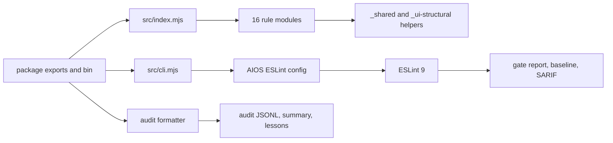

# Modernization Audit

**Date:** 2026-07-10
**Baseline:** `v0.3.0` (`dd379148f7f3230cd7e711d231cb8ae95e5081d9`)

## Verdict

This package should receive a targeted in-place modernization, not a parallel
v2 or framework rewrite. It is a compact, acyclic ESM ESLint package with a
substantive test and distribution baseline. Replacing its delivery model or
rewriting every rule would create more semver risk than product value.

The high-value work is to make the gate fail closed, establish one owner for
the rule catalog and finding identity, calibrate the highest-risk heuristics,
and make the release-quality claims executable.

## Baseline

The following checks passed against `v0.3.0`:

| Check | Result |
| --- | --- |
| `pnpm verify` | Pass: 151 tests, source LCOV, local consumer smoke, packed-tarball smoke |
| `pnpm test` | Pass: 151/151 |
| `pnpm build` | Pass: `pnpm pack --dry-run` |
| `pnpm typecheck` | Pass: JavaScript syntax check for 39 files |
| `pnpm format` | Pass: whitespace/JSON hygiene for 83 files |
| `pnpm audit:dead-code` | Pass: 38 reachable JavaScript files |
| `pnpm secret:scan` | Pass |
| `pnpm dependency:security` | Pass: no advisories |

No application UI, database, authentication system, background job, or
persistent user data exists in this repository. The relevant product surface
is the published plugin, its CLI, audit artifacts, documentation, and release
workflow.

## Current System

The code is already divided along useful lines:

- `src/rules/` holds 16 independently readable rules.
- `_shared.mjs` owns product-copy and JSX helpers; `_ui-structural.mjs` owns
  static class/style extraction.
- `src/gate.mjs`, `src/cli.mjs`, and `src/audit.mjs` implement the CLI and
  machine-readable integration surface.
- `smoke-consumer/` and `scripts/smoke-published.mjs` exercise local and packed
  consumer paths.

## Parts Worth Retaining

- Raw Node ESM delivery with Node 22.13+ or Node 24+ and ESLint 9 support. A TypeScript source
  rewrite or build-output migration has no demonstrated payoff.
- Individual rule modules and their narrow shared helpers. Do not replace them
  with a generic rule DSL or regex framework.
- The published subpaths, CLI binary, formatter shim, baseline behavior, audit
  artifacts, and packed-tarball smoke. They are real downstream contracts.
- The current RuleTester coverage and separate CLI, gate, and audit tests.
- Trusted npm publishing with provenance and the Node 22.13/24 CI matrix.

## External Contracts and Constraints

The following must be treated as public unless deliberately versioned and
migrated:

- `package.json` exports, `anti-slop` binary, package file layout, and
  `eslint-plugin-anti-slop/audit-formatter.mjs` filesystem path.
- All 16 namespaced rule IDs, preset severities, rule options, documentation
  URLs, and `settings["anti-slop"]` vocabulary.
- CLI flags, exit codes, JSON/JSONL/Pre-CR/SARIF report shapes, baseline
  fingerprints, and `anti-slop.config.json` fields.
- Audit event schema `1.0` history and `1.1` current output, artifact paths,
  redaction, append behavior, and branch policy.
- ESM import behavior, Node 22.13+ or Node 24+, ESLint 9 flat config, local linked-checkout
  development, and OIDC/provenance release flow.

Gate baselines do not need a data migration. Audit output moves to a versioned
`1.1` event envelope because its fingerprint identity changes: readers retain
valid `1.0` history but group it separately, and downstream consumers that need
a single schema must archive `gate-events.jsonl` before the first upgraded run.
The rollback anchor is the existing `v0.3.0` tag. Any later intentional finding
fingerprint or report-shape change must include equivalent baseline/output
migration guidance.

## Findings

### P1 — gate correctness and contract safety

1. `anti-slop.config.json` is merged without schema validation in
   `src/gate.mjs`. Invalid modes can yield a non-blocking result rather than a
   clear configuration error.
2. Fatal ESLint/parser errors are excluded from Anti-Slop findings, allowing a
   gate to report success although analysis did not complete.
3. `audit` has inconsistent direct and CLI policy semantics; model requested
   mode, effective policy, and decision separately.
4. The rule registry, metadata table, preset generation, and docs URL mutation
   have multiple manual owners (`src/index.mjs`, `src/rule-metadata.mjs`,
   `src/gate.mjs`, and `src/audit.mjs`). This is the principal internal drift
   risk.
5. Public declarations are shipped but not compiler-validated. The current
   `typecheck` command is a syntax check, not a TypeScript declaration check.
6. CI/release run only `pnpm verify`, which omits defined formatting, syntax,
   reachability, secret, and dependency-security checks.

### P2 — observable behavior and rule confidence

1. README tells users to run `anti-slop --help`, but the root help path exits
   with an error.
2. `--changed` falls back to a full project scan on a clean tree, contrary to
   its fast-gate positioning.
3. Feature-branch audit events use `decision: "warn"` while declaring
   `event_type: "commit_blocked"`.
4. Gate and audit fingerprints use different identity rules, so repeated
   finding reporting can disagree with baselines.
5. High-severity rules need additional characterization before they become more
   aggressive:
   - `no-demo-data-primary-path` treats an unrelated data call as sufficient
     evidence for fixture data on a primary route.
   - `no-unjustified-use-client` removes a directive using a file-local
     heuristic that cannot know every framework boundary.
   - `require-reduced-motion` does not distinguish transition fallbacks from
     animation fallbacks and has false positives for `animation: "none"`.
   - the shared static-class extractor flattens mutually exclusive branches,
     which can create false positives for motion and reveal rules.
   - `require-empty-state-action` detects generic `"no "` text and accepts
     actions outside a meaningful local empty-state block.
6. Planning and truth documents conflict with the released `0.3.0` state;
   `CONTRIBUTING.md` also overstates what `pnpm verify` runs. The untracked
   user-owned `skills/` directory still describes `0.2.x` and must not be
   changed by this modernization branch without explicit ownership.

### P3 — release hardening opportunities

- The ESLint 9.0 floor job runs unit tests but not real CLI/formatter/packed
  smoke flows.
- Coverage is generated but not enforced in CI; the threshold lives only in an
  optional global Pre-CR path.
- Dependency audit intentionally fails open when the registry cannot be
  reached. That may be right for offline local work, but release CI needs an
  explicit policy.
- GitHub Actions use tag pins rather than immutable commit pins; publishing
  does not assert that the release tag matches `package.json`.
- `format` is hygiene validation rather than formatting, and the Node runtime
  floor should be reconciled with locked dependency engine requirements.

## Target Scorecard

| Area | Current | Target | Basis |
| --- | ---: | ---: | --- |
| Product coherence | 4 | 5 | Clear current purpose; explicit confidence model and gate behavior will sharpen it. |
| Correctness and data integrity | 3 | 5 | No persistent data, but invalid configuration and analysis failure can currently pass a gate. |
| Architectural coherence | 3 | 5 | Rule catalog and finding identity need one owner. |
| Maintainability | 3 | 5 | Remove manual registry/metadata drift while retaining readable rule modules. |
| Testability | 4 | 5 | Add executable public-contract and packed type-consumer coverage. |
| Security and privacy | 4 | 5 | Good provenance/redaction; make release security policy explicit. |
| CLI/documentation accessibility | 4 | 5 | Improve help, error diagnostics, and command-matrix truthfulness. |
| Performance | 4 | 4 | No demonstrated performance bottleneck; preserve the small static-analysis footprint. |
| Operability | 4 | 5 | Make CI/release gates authoritative and auditable. |
| Developer experience | 3 | 5 | One documented, executable verification path and accurate state. |

## Audit Decision

Choose **A: a deep internal refactor in place**, scoped to the contracts above.
Do not create a parallel package, rewrite every rule, convert the package to a
new framework, or expand the rule catalog before the existing product's
correctness and confidence model are hardened.
