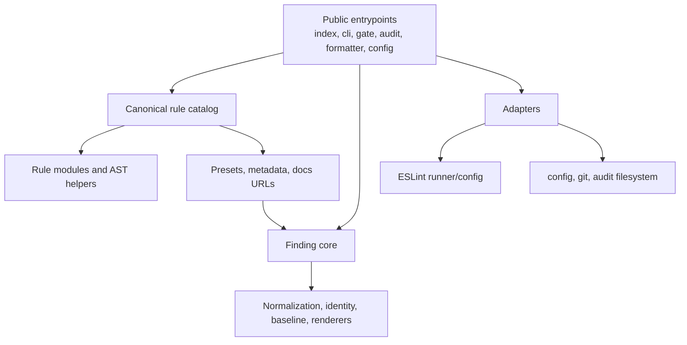

# Modernization Target

## Product Direction

`eslint-plugin-anti-slop` should become the trustworthy quality-gate layer for
React and TypeScript product code: opinionated, explainable, configurable, and
safe to adopt in CI. Its value is not the number of rules; it is the confidence
that a reported result means the source was actually analyzed and that the
recommended action is proportionate to the evidence.

The `0.4` hardening release is the existing GitHub Release and remains absent
from npm. The next release target is a focused **0.5.0 pre-1.0 compatibility
release**: it drops End-of-Life Node 20 support and retains Node 22.13 and Node
24. This is an intentional breaking support-policy change, so it requires an
explicit version and migration decision before release.

## Design Principles

1. A gate must fail clearly when it cannot analyze source or interpret its
   configuration. It must never report a clean pass by silently discarding a
   parser/configuration failure.
2. Each rule's identity, metadata, preset severity, and documentation location
   have one internal owner.
3. Retain simple AST rule modules. Share only stable evidence extraction or
   contract concepts; do not introduce a general-purpose rule framework.
4. Separate deterministic blocking signals from heuristic advisory signals in
   metadata and documentation. Preserve current presets until a deliberate
   release changes them.
5. Test consumer-visible behavior from the outside: packed imports, declaration
   resolution, CLI exits, output formats, formatter artifacts, and real ESLint
   versions.
6. Keep local work deterministic and fast. Treat network-dependent supply-chain
   checks explicitly rather than pretending they are equivalent to offline
   verification.
7. Keep docs, release metadata, and planning state as current snapshots, not
   historical narratives.

## Target Architecture

Existing entrypoint paths remain public facades. Internal ownership becomes
explicit without forcing a source-language or build-system rewrite.

Proposed internal boundaries:

| Domain | Owns | Does not own |
| --- | --- | --- |
| Rule catalog | canonical rule ID, module, confidence metadata, presets, required fix, docs slug | AST implementation details |
| Rule modules | focused AST detection and rule-specific options | public registration or report rendering |
| Finding core | normalized analysis failures/findings, identity, baselines, text/JSONL/SARIF reports, audit-event mapping | process, filesystem, or ESLint construction |
| Adapters | ESLint configuration, CLI parsing, JSON config I/O, git branch lookup, audit artifact persistence | policy calculations and report semantics |
| Public entrypoints | compose/re-export stable public interfaces | duplicate business logic |

The manifest must derive the existing plugin rules, both presets, metadata
lookup, docs URLs, and SARIF rule records. `src/rule-metadata.mjs` remains as a
compatibility facade at its current export path. The current rule files,
`_shared.mjs`, `_ui-structural.mjs`, `audit-formatter.mjs`, and all package
subpaths remain unless a consumer-proven replacement exists.

## Behavioral Target

### Gate policy

- Parse and validate `anti-slop.config.json` before invoking ESLint. Unknown
  fields, invalid modes, and malformed baseline data return a clear CLI usage
  or configuration error (exit 2).
- Represent requested mode, effective policy, analysis status, and gate decision
  as distinct concepts. `audit` can still exit zero after successful analysis,
  but it cannot conceal an analysis/configuration failure.
- Include non-Anti-Slop fatal ESLint/parser errors in analysis status and report
  them as analysis failures rather than silently filtering them out.
- Treat root help and subcommand help as successful usage output.
- Define clean-tree `--changed` behavior explicitly: default to zero files and
  a successful no-op, with any full-scan fallback requiring an explicit option.
- Use one stable, documented finding identity algorithm in both gate and audit
  flows. Preserve v0.3 baselines unless a versioned migration is released.
- Use neutral audit event types for warning-only observations.

### Rule confidence

Before broadening detection or adding new rules, add fixtures that capture the
known ambiguity:

- direct fixture-data use versus unrelated data calls in primary routes;
- intentional client-boundary directives and autofix safety;
- animation-specific versus transition-specific reduced-motion fallbacks;
- mutually exclusive static class paths;
- local empty-state content and local actions.

The target is a confidence model in catalog metadata (for example, blocking,
advisory, and review-only/autofix-safe) that explains why a rule has its preset
severity. Existing `recommended` and `strict` output remains stable unless a
release note deliberately changes it.

## Verification and Release Target

The repository should expose three honest command groups:

| Command group | Purpose | Expected properties |
| --- | --- | --- |
| deterministic verification | format/hygiene, syntax, dead-code reachability, secret policy, unit/contract tests, coverage policy, package build, locked local-consumer smoke | required locally and in CI without fresh registry resolution |
| online package compatibility | packed-tarball smoke, declaration compilation, current ESLint compatibility | explicit fresh-consumer registry resolution in CI/release |
| supply-chain verification | dependency audit | explicit registry requirement in CI/release |

The packed consumer must compile TypeScript with `--noEmit` and import every
declared package subpath. The ESLint 9.0 floor job must run at least one genuine
CLI/config/formatter consumer smoke, not only unit tests. Release verification
must assert that the release tag and `package.json` version agree.

## Non-Goals

- A new frontend, UI component system, database schema, or application shell.
- A TypeScript source conversion, bundler adoption, or `dist/` migration solely
  for modernization aesthetics.
- A generic lint-rule DSL or broad abstraction over the existing rule modules.
- An expanded rule catalog before existing high-severity rules have consumer
  calibration.
- Unannounced changes to rule IDs, output schemas, baselines, or CLI file paths.
- Editing untracked user-owned `.agents/` or `skills/` content.

## Human Decision Boundary

No product decision blocks the initial hardening work. This plan defaults to
preserving all existing public entrypoints and shipping user-visible correctness
fixes as a 0.4 release. Pause before any intentionally breaking change to a
rule ID, preset default, report schema, fingerprint algorithm, Node/ESLint
support range, or package entrypoint.
